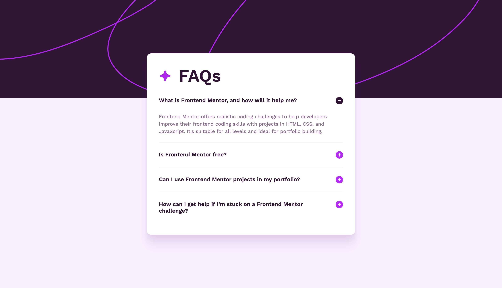

# Frontend Mentor - FAQ accordion solution

This is a solution to the [FAQ accordion challenge on Frontend Mentor](https://www.frontendmentor.io/challenges/faq-accordion-wyfFdeBwBz). Frontend Mentor challenges help you improve your coding skills by building realistic projects. 

## Table of contents

- [Overview](#overview)
  - [The challenge](#the-challenge)
  - [Screenshot](#screenshot)
  - [Links](#links)
- [My process](#my-process)
  - [Built with](#built-with)
  - [What I learned](#what-i-learned)
  - [Continued development](#continued-development)
  - [Useful resources](#useful-resources)
- [Author](#author)

## Overview

### The challenge

Users should be able to:

- Hide/Show the answer to a question when the question is clicked
- Navigate the questions and hide/show answers using keyboard navigation alone
- View the optimal layout for the interface depending on their device's screen size
- See hover and focus states for all interactive elements on the page

### Screenshot



### Links

- Solution URL: [Link to Frontend Mentor](https://www.frontendmentor.io/solutions/faq-accordion-with-animations-H19IzuEwY5)
- Live Site URL: [GitHub Live Site](https://darrenohello.github.io/faq-accordion-main/)

## My process

### Built with

- Semantic HTML5 markup
- CSS custom properties
- Flexbox and CSS Grid
- JavaScript

### What I learned

- How to use JavaScript to toggle the display of elements in order to create an accordion component. 
- How to trap keyboard focus within the DOM.
- How to apply focus states visible with keyboard navigation only.
- How to add microinteraction animations to the accordion icons using CSS transform.

To see how you can add code snippets, see below:

```css
/* microinteraction animation on accordion icon */
.accordion-header .icon {
  transform: rotate(-90deg);
}

.accordion-header.active .icon {
  transform: rotate(0);
}
```

### Continued development

- I made some compromises with the background banner implementation.
- I first used the provided SVG file and with good CSS styling found that using the separate mobile file wasn't necessary.
- However, using Lottie I was able to achieve an animated background but found that I wasn't able to apply the same CSS properties to it, for example object-fit: cover.
- It also seems to take a split second to load in the Lottie animation, even though it's lightweight. Whereas the SVG appeared almost instantly.

- I also noticed on inactive focussed accordions the hover state wouldn't display, which I think would be a good thing to fix.

### Useful resources

- [Smooth Shadows](http://smoothshadows.com/) - A helpful CSS generator for smooth, realistic CSS shadows through layering.


## Author

- Website - [My Portfolio](https://darrenohehir.com/)
- Frontend Mentor - [@darrenohello](https://www.frontendmentor.io/profile/darrenohello)
- Instagram - [@darrenohehir](https://www.instagram.com/darrenohehir)
- LinkedIn - [Darren M O'Hehir](https://www.linkedin.com/in/darrenohehir/)
